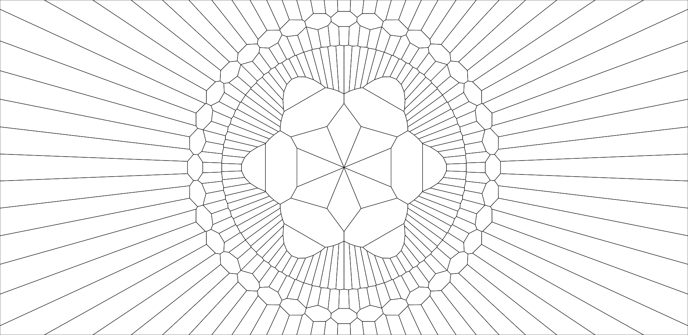
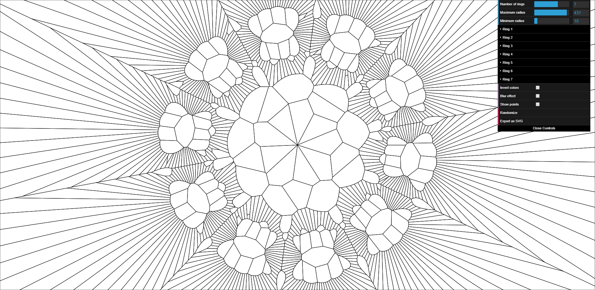

Series of visual experiments exploring Voronoi diagrams using JavaScript

### Inspiration
* [Ornaments in a Box](https://www.flickr.com/photos/quasimondo/albums/72157632200834828) series by Mario Klingemann

## Packages used

* [d3-delaunay](https://github.com/d3/d3-delaunay) for fast, robust Voronoi diagram generation.
* [p5.js](https://www.npmjs.com/package/p5) for canvas drawing and miscellaneous helper functions (like `lerp` and `map`).
* [Webpack](https://webpack.js.org/) for modern JS (ES6) syntax, code modularization, bundling, and serving locally.
* [dat.GUI](https://github.com/dataarts/dat.gui) for a parametric UI

## Key commands

| Key | Action                      |
|---  |---                          |
| `r` | Reset sketch                |
| `i` | Invert colors               |
| `p` | Toggle visibility of points |
| `b` | Toggle blur effect          |

## Install notes

1. Run `npm install`
2. Run `npm run serve`

## Screenshots

